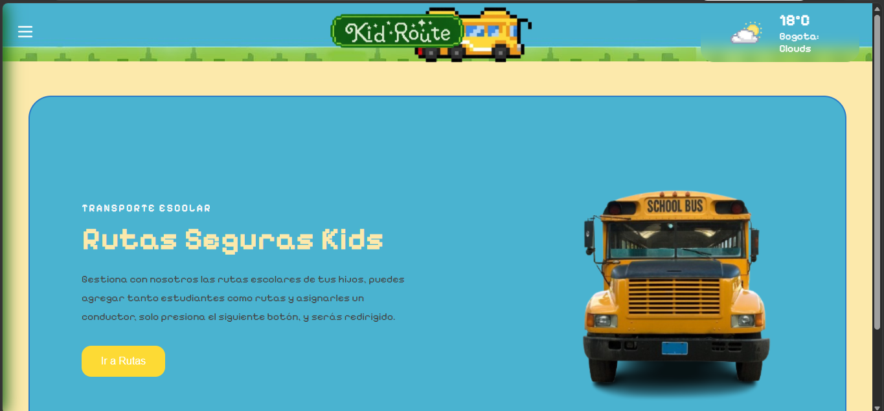
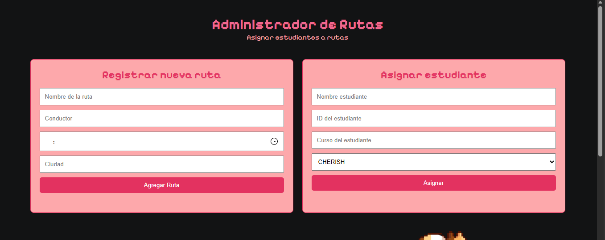
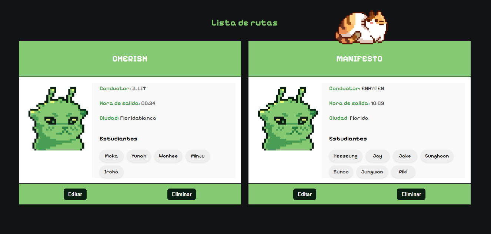
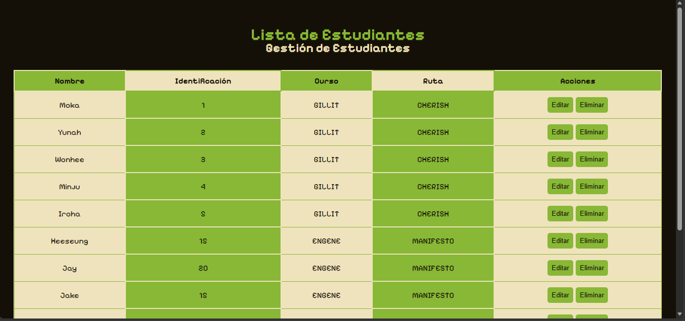
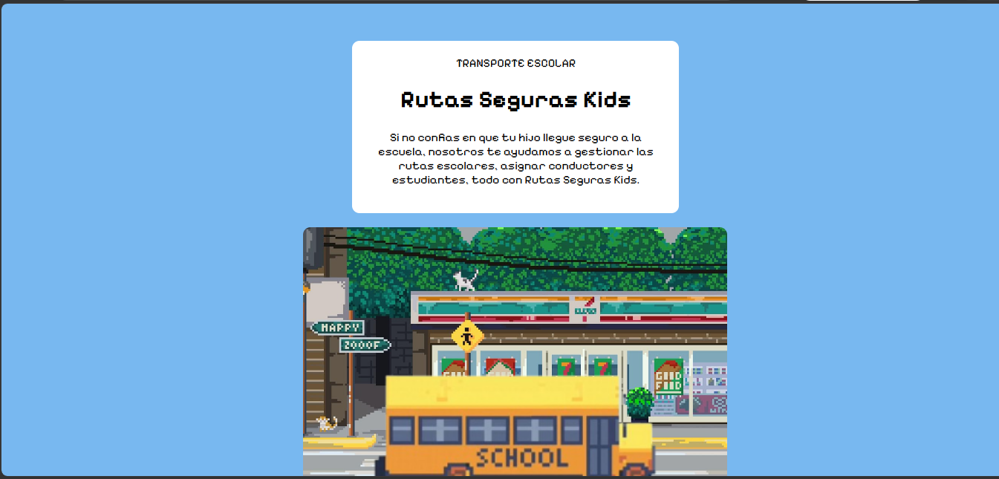

# README.md

## 🚍 Rutas Seguras Kids

Sistema frontend para la gestión de rutas escolares y asignación de estudiantes, desarrollado únicamente
---

# 📌 Descripción del Proyecto

Rutas Seguras Kids es una aplicación web que permite crear y administrar rutas escolares, Los usuarios pueden agregar rutas, asignar estudiantes, editar información y visualizar datos actualizados en tiempo real desde la interfaz.

Además, el proyecto integra una API pública para mostrar información climática relacionada con las rutas.

---

# 🎯 Objetivos

* Manipular dinámicamente el DOM.
* Utilizar eventos y asincronía.
* Implementar Web Components reutilizables.
* Consumir APIs públicas con `fetch`.
* Crear una interfaz responsive y organizada.

---

# ⚙️ Tecnologías Utilizadas

* HTML5
* CSS3
* JavaScript (Vanilla JS)
* OpenWeather API

---

# ✨ Funcionalidades

## Gestión de rutas

* Crear rutas escolares.
* Editar rutas existentes.
* Eliminar rutas.
* Asignar estudiantes a cada ruta.

## Interactividad

* Actualización dinámica del contenido.
* Validación de formularios.
* Eventos personalizados con `CustomEvent`.

## API Clima

* Consulta del clima mediante API pública.
* Uso de `fetch` y `async/await`.

## Web Components

* Componente personalizado.
* Uso de `template` y `Shadow DOM`.

## Responsive

* Adaptación a celulares, tablets y escritorio.
* Implementación de breakpoints con `@media`.

---

# 📂 Estructura del Proyecto

```bash
📁 realProyectito
│
├── 📁 img
│   └── /img/.png
│   (HomePage)
├── index.html
├── index.css
├── app.js
│   (Ruta)
├── rutas.html
├── rutas.css
├── rutas.js
│   (Lista)
├── students.html
├── students.css
├── students.js
│   (final)
├── aboutus.html
├── aboutus.html
├── about us.html
│ 
├── README.md
├── explanation.txt

```


# 🌦️ API Utilizada

## OpenWeather API

Permite obtener información climática en tiempo real, presenta un cambio cada cierto tiempo.


---

# 📸 Capturas de Pantalla

La página principal que cuenta con la API del clima y un menú hamburguesa


La administración de rutas, el usuario puede crear una ruta y aparecerá automáticamente en la parte inferior, además puede agregarle estudiantes que apareceran dentro de la ruta, y podrá editar los componentes de la ruta (Nombre, conductor, hora de salida y ciudad), además de eliminar los estudiantes de la ruta.



Despues de crear la ruta, podrá dirigirse al apartado de estudiantes, que mostrará una lista editable de los datos antes creados, podrá editar los componentes de los estudiantes y podrá eliminarlos.


Para cerrar, un corto about us o el por qué preferirnos.


---
# 👨‍💻 Autor

@sunisonfire
Danna Téllez

---

# 🔗 Repositorio

[https://github.com/sunisonfire/KidRoute.git]


